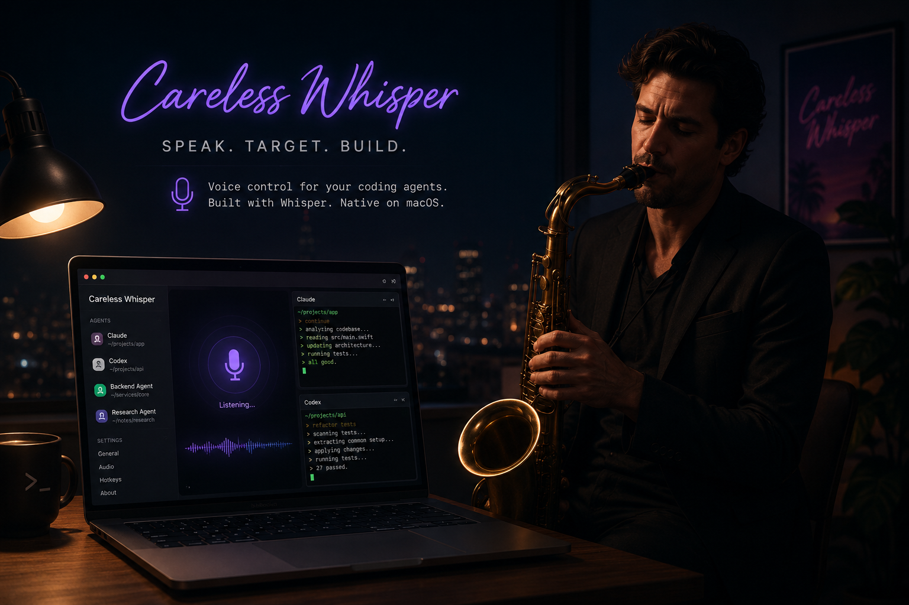

# CarelessWhisper



CarelessWhisper is a macOS menu-bar dictation injector for Claude, Codex, and OpenCode.

When enabled, it listens for speech, transcribes locally with a directly linked `whisper.cpp` backend, and types the result into a supported coding-agent window. It can also remember the last supported target, so you can click around in other apps while still dictating back into your terminal or agent.

CarelessWhisper is built for local/offline use. Audio is recorded and transcribed on your machine.

## Features

- Always-on dictation while enabled.
- Local `whisper.cpp` transcription through a C bridge linked into the Swift app.
- No Python, Torch, ffmpeg, or Homebrew `whisper-cli` path.
- Sticky target mode: reactivate the last Claude/Codex/OpenCode target before typing.
- Supported terminal detection for Claude, Codex, and OpenCode CLIs.
- Sensitivity, start-delay, and stop-delay sliders.
- Voice commands for stopping dictation and toggling common settings.
- Sanitizes common Whisper non-speech tags such as `[MUSIC]`, `[SOUNDS]`, and `[BLANK_AUDIO]`.
- Packaged `.app` can ship without a model and download the selected GGML model on demand.

## Requirements

- macOS 14 or newer.
- Xcode Command Line Tools.
- CMake.
- Internet access for the first build, to download `whisper.cpp` source. A model is downloaded on first selection from the app menu unless you bundle one yourself.

Install the command-line tools if needed:

```bash
xcode-select --install
```

Install CMake. With Homebrew:

```bash
brew install cmake
```

## Quick Start

```bash
git clone https://github.com/ctlst/carelesswhisper.git
cd carelesswhisper
./install.sh
open /Applications/CarelessWhisper.app
```

`install.sh` checks for the required macOS build tools, then runs `make install`.

On first launch, grant:

- **Microphone** permission, for recording.
- **Accessibility** permission, for typing into the active target.

If the Accessibility prompt does not appear, open System Settings -> Privacy & Security -> Accessibility and enable `CarelessWhisper.app`.

## How It Works

The normal path is:

```text
Swift menu-bar app
-> AVAudioRecorder 16 kHz mono WAV
-> Swift VAD-style speech/silence detection
-> C bridge
-> linked whisper.cpp static libraries
-> selected GGML model
-> command parser
-> CGEvent typing into the target app
```

The app bundle contains the Swift executable and native `whisper.cpp` linkage. Model files are data loaded at runtime, so packaged builds can omit them and download the selected model into Application Support.

## Usage

The **Enabled** menu item is the arming switch.

When enabled:

- If Claude, Codex, OpenCode, or a supported terminal running one of those CLIs is focused, CarelessWhisper listens for speech.
- If speech is detected, it records until silence, transcribes, types the text, optionally presses Return, then listens again.
- If type-anywhere mode is on, CarelessWhisper skips target checks and types into the currently focused app/cursor.
- If sticky target mode is on, CarelessWhisper remembers the last supported target and reactivates it before typing.
- If type-anywhere mode is off, sticky target mode is off, and no supported target is focused, it waits without recording or injecting text.

Menu controls:

- **Enabled**: arms/disarms listening.
- **Type Anywhere**: bypasses Claude/Codex/OpenCode targeting and types into the current focused app.
- **Auto-Return**: submits after typing.
- **Sticky Target**: reactivates the last supported target before typing.
- **Sensitivity**: higher values detect quieter speech.
- **Start**: minimum recording time before silence can stop the capture.
- **Stop**: silence duration required to finish an utterance.
- **Model**: selects the Whisper model. `Base English` is bundled; larger models download when selected and are used after the download finishes.

Downloaded models are stored in `~/Library/Application Support/CarelessWhisper/models/whisper.cpp/`.

## Voice Commands

These are interpreted only when the whole utterance is a short matching phrase. Longer sentences are typed normally.

Stop dictation:

- `stop listening`
- `stop dictation`
- `disable dictation`
- `turn off listening`

Edit commands:

- `undo`
- `redo`

Pause typing:

- `pause typing`
- `resume typing`
- `toggle typing`

Sticky target:

- `enable sticky target`
- `disable sticky target`
- `toggle sticky target`

Type anywhere:

- `type anywhere`
- `targeted mode`
- `toggle type anywhere`

Submit behavior:

- `press return`
- `do not press return`
- `toggle submit`

After `stop listening`, CarelessWhisper is no longer recording, so it cannot hear a voice command to start again. Re-enable it from the menu bar. A command-only wake listener is tracked in [IDEAS.md](IDEAS.md).

## Supported Targets

Desktop apps:

- Claude
- Claude Code
- Codex
- OpenCode

Supported terminal apps:

- Terminal
- iTerm2
- Ghostty
- Warp
- Alacritty
- kitty
- WezTerm
- Hyper

For terminal targets, CarelessWhisper checks that a `claude`, `codex`, or `opencode` process is running before injecting text.

## Build Targets

```bash
make setup-native
```

Downloads vendored `whisper.cpp` and builds static libraries.

```bash
make download-base-model
```

Downloads `ggml-base.en.bin` for local testing or bundled builds.

```bash
make app
```

Builds `CarelessWhisper.app` in the repo.

By default, app bundles do not include model files. To include locally downloaded models in the bundle:

```bash
BUNDLE_MODELS=1 make app
```

```bash
make install
```

Builds and installs `/Applications/CarelessWhisper.app`.

```bash
make run
```

Runs from SwiftPM for development.

```bash
make clean
```

Removes Swift build output and local app bundle. It does not remove downloaded models or vendored source.

## Configuration

Environment variables:

- `CARELESSWHISPER_LANGUAGE`: Whisper language, default `en`.
- `CARELESSWHISPER_CPP_MODEL`: path to a GGML `whisper.cpp` model.
- `CARELESSWHISPER_CPP_MODEL_NAME`: model filename under `.models/whisper.cpp`, default `ggml-base.en.bin`.

## Troubleshooting

Check the debug log:

```bash
tail -f ~/.config/carelesswhisper/debug.log
```

If the yellow macOS microphone indicator is on but nothing types:

- Confirm Accessibility permission is granted to `/Applications/CarelessWhisper.app`.
- Confirm **Enabled** is on in the menu.
- Focus a supported target once so sticky target mode has something to remember.
- Check the debug log for `blocked` or transcription errors.

If build fails because CMake is missing:

```bash
brew install cmake
```

## Repository Notes

Generated or heavy artifacts are intentionally ignored:

- `.build/`
- `Vendor/`
- `.models/`
- `CarelessWhisper.app/`

They are recreated by `make install`.

## License

MIT. See [LICENSE](LICENSE).
